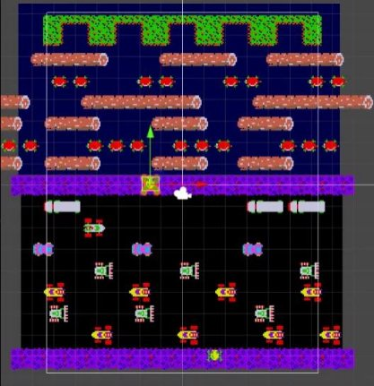
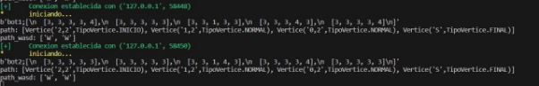
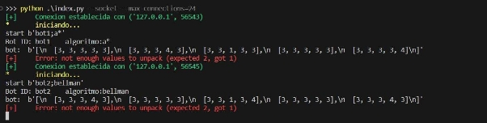
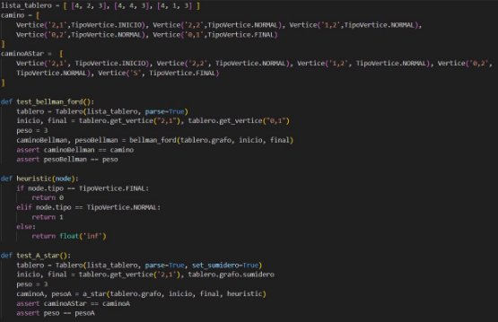
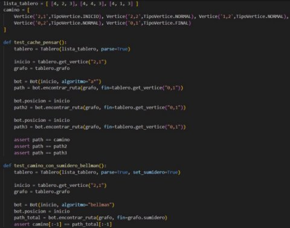
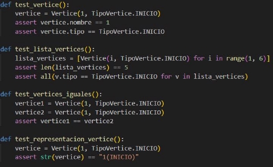
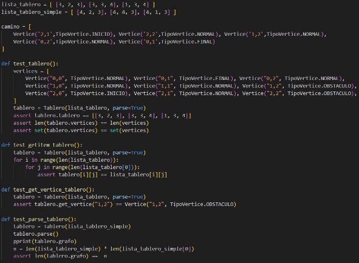
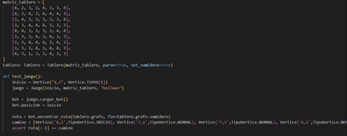
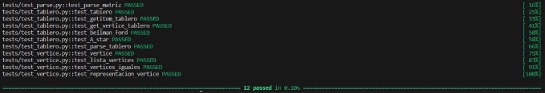
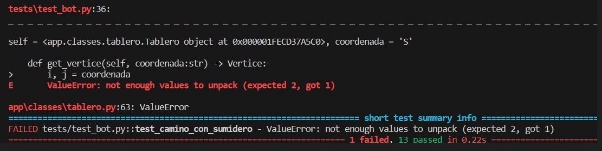

# Tabala de contenido

1. [**Descripción del problema**](#_descripcion)
    - [Detección de obstáculos](#_detecObs)
    - [Planificación de movimiento](#_planifMov)
    - [Evaluación del éxito](#_evaExito)
    - [Interfaz de usuario](#_interfaz)

2. [**Descripción del conjunto de datos**](#_descDataSet)  
3. [**Propuesta**](#_propuesta)  
4. [**Técnicas y metodología**](#_tecMetod)  
    - [Mecánica del juego](#_mecanica)  
    - [Objetivos y reglas](#_objReglas)  
    - [Optimización y rendimiento](#_optmiz)
5. [**Diseño de la aplicación**](#_diseñoApp)  
6. [**Bibliografía**](#_biblio)

# **Descripción del problema**

El objetivo principal de este proyecto es diseñar un bot capaz de jugar de manera autónoma el juego Frogger. Frogger es un juego clásico de arcade en el que un jugador controla a una rana que debe cruzar una carretera llena de obstáculos y un río con troncos y tortugas en movimiento. El desafío radica en evitar ser golpeado por vehículos en la carretera y caer al agua en el río.

El bot debe abordar los siguientes desafíos clave:

## **Detección de obstáculos** 
Como en la vida cotidiana hay muchas cosas que utilizan la detección de objetos, por ejemplo los coches autónomos. Según (colaboradores de Wikipedia, 2023) La detección de objetos es una tecnología de ordenador relacionada con la visión artificial y el procesamiento de assets/imagen que trata de detectar casos de objetos semánticos de una cierta clase. Para nuestro caso no usaremos una detección de objetos basada en visión artificial. El bot desarrollado debe ser capaz de identificar y rastrear la posición de vehículos, troncos y tortugas en movimiento en tiempo real para evitar colisiones y asegurarse de que la rana llegue a salvo al otro lado de la pantalla. Según los parámetros que recibe del entorno.

## **Planificación de movimiento** 
El bot debe tomar decisiones inteligentes sobre cuándo y cómo moverse, considerando factores como la velocidad de los obstáculos,  la ubicación de la rana y los posibles lugares de destino en el río. Para esto usaremos el algoritmo Bellman-Ford (Wikipedia contributors, 2023). Transformaremos el juego en un grafo y encontraremos el camino más corto desde donde estamos hasta el final. Esto nos ayudará a planificar el movimiento de nuestra rana hacia la meta.

1. ## **Evaluación del éxito** 
   El bot debe estar programado para reconocer cuándo ha tenido éxito en cruzar con éxito a la rana al otro lado de la pantalla y, por lo tanto, ganar puntos en el juego. Es decir, guardar los intentos con sus resultados.

2. ## **Interfaz de usuario:** 
   Se debe proporcionar una interfaz de usuario que permita a los usuarios observar y controlar el progreso del bot y, posiblemente, ajustar su nivel de dificultad. 

   Este proyecto implica un desafío técnico significativo en términos de visión por computadora, toma de decisiones algorítmicas y diseño de interfaz. 

# **Descripción del conjunto de datos** 
Nuestro conjunto de datos se basa en todo el tablero. El tablero del juego se convierte en un grafo ponderado dirigido en el cual nuestra rana tendrá que ir de un nodo inicial (I) hasta un nodo final (F).
Un tamaño aproximado de nuestro tablero será de 30 x 50. Haciendo que, en el mejor de los casos, existan 1500 nodos que recorrer. Pero nuestro bot, al momento de utilizar los algoritmos mencionados, recorrerá más de 1500 nodos para poder encontrar el camino correcto para poder llegar a la meta.
Además, consideramos el uso de dos algoritmos diferentes, por lo cual, el espacio de búsqueda se duplica. El tener dos algoritmos, aparte de aumentar nuestro espacio de búsqueda, nos permitirá saber y comparar, con qué algoritmo la rana llega primero.  

# **Propuesta**
Este proyecto tiene como objetivo desarrollar un bot autónomo para el juego Frogger, un juego de arcade clásico. Frogger desafía a los jugadores a guiar una rana a través de una carretera llena de obstáculos y un río con troncos y tortugas en movimiento. El bot se enfrentará a desafíos clave, incluyendo la detección de obstáculos, planificación de movimiento, evaluación de éxito y una interfaz de usuario.

# **Técnicas y metodología:**
## **Mecánica del juego** 
- Mantendremos la mecánica del juego original. El juego, los personajes, obstáculos y más serán como se conoce.
## **Objetivos y reglas**
- Los objetivos son los originales, avanzar lo más que se pueda, evitando obstáculos, evitar caer al agua, ser atropellado, etc.
- Se tendrá 3 vidas cada vez que se inicia el juego, si chocas contra un obstáculo el juego se reiniciará y perderás una vida.

## **Optimización y rendimiento**
- Usaremos la técnica de memoización para optimizar el juego y el bot, para que su proceso sea más rápido. 

# **Diseño de la aplicación**
Para el diseño de esta aplicación hemos separado el trabajo en 2 partes, un frontend (parte de la UI) y el backend (desarrollo del algoritmo y conexión al frontend).

## Frontend  
El frontend del juego, desarrollado en Unity, se encarga de proporcionar la interfaz visual y la experiencia de usuario. Aquí se detalla cómo se desarrolla el frontend y se interactúa con el jugador:

- **Clase Personaje:**

    Esta clase representa al personaje controlado por el bot (la rana). Aquí se definen los movimientos, las animaciones y la lógica de colisiones de la rana.

    **Métodos de Movimiento:**

    - `MoveUpInput()`, `MoveDownInput()`, `MoveLeftInput()`, `MoveRightInput()`: Métodos abstractos que deben ser implementados por las clases derivadas para manejar las entradas de la rana.
    - `MoveCharacter(Vector3 direc)`: Mueve la rana en la dirección especificada, verifica colisiones con barreras, plataformas y obstáculos, y gestiona el movimiento y las animaciones de la rana.
    - `Salto(Vector3 desti)`: Corrutina que realiza la animación de salto de la rana hacia la posición de destino.

    **Métodos de Juego:**

    - `Muerto()`: Método llamado cuando la rana muere (colisiona con un obstáculo). Detiene las animaciones, muestra la animación de muerte y programa la reaparición de la rana después de un breve período de tiempo.
    - `respawn()`: Método para reiniciar la posición y estado de la rana.

    **Colisiones:**

    - `OnTriggerEnter2D(Collider2D other)`: Método que maneja las colisiones de la rana con obstáculos. Si la rana colisiona con un obstáculo, se activa la animación de muerte y se programa su reaparición.

---------

- **Clase Movimientoloop:**

    Esta clase controla el movimiento en bucle de los obstáculos a lo largo de la pantalla.

    **Variables:**

    - `direction`: Dirección del movimiento de los obstáculos.
    - `speed`: Velocidad de movimiento de los obstáculos.
    - `size`: Tamaño de los obstáculos para determinar cuándo deben reiniciarse.

    **Métodos de Movimiento:**

    - `Update()`: Controla el movimiento de los obstáculos en la dirección especificada. Cuando un obstáculo sale de la pantalla, su posición se reinicia al lado opuesto para crear un movimiento continuo.

---------

- **Clase Casa:**  
    Esta clase gestiona las colisiones entre la rana (jugador) y las casas en el juego.

    **Variables:**

    - `frog`: Referencia al objeto de la rana controlada por el jugador.

    **Métodos de Colisión:**

    - `OnEnable()`: Se activa cuando el objeto casa se habilita. Activa la rana.
    - `OnDisable()`: Se activa cuando el objeto casa se deshabilita. Desactiva la rana.
    - `OnTriggerEnter2D(Collider2D collision)`: Maneja las colisiones entre la rana y las casas. Si la rana colisionó con una casa, se desactiva temporalmente y se programa su reaparición.

## Funcionamiento General del Juego

El jugador controla la rana usando las entradas definidas en la clase `Personaje`.
Los obstáculos se mueven en bucle de un lado a otro de la pantalla utilizando la clase `Movimientoloop`.
Cuando la rana colisiona con un obstáculo, se activa la animación de muerte y se programa su reaparición después de un corto período de tiempo.
Si la rana alcanza una casa, se desactiva temporalmente y se programa su reaparición.

Para el caso del backend, este ha sido desarrollado usando el lenguaje de programación de python en su versión 3.10. Se han diseñado unas cuantas clases para abstraer el concepto del juego y conceptos básicos de grafos. Se ha usado la programación orientada a objetos para la representación y abstracción de conceptos. Además de aplicar el concepto de responsabilidad única para cada una de las funciones y hacer el código más legible y más fácil de testear.

- **Clase Vertice:**  
    Esta clase representa un vértice de un grafo, posee un nombre y un tipo. Nuestro vértice a parte de hacer referencia a un vértice de un grafo también representa una casilla de nuestro tablero. Esta clase tiene como atributos nombre y tipo, El nombre es como un identificador del vértice (por ejemplo vértice A o vértice 1) y el tipo hace referencia a que tipo de casilla es la del tablero, esta está dada en base a un enum con los siguientes tipo: INICIO, FINAL, NORMAL y OBSTÁCULO.

---------

- **Clase Tablero:**  
    Corresponde a una representación del tablero utilizado para el juego y es el que se muestra en el frontend. Esta clase tiene como atributos:

    - `tablero`: Lista de listas (matriz) que representa fielmente el tablero
    - `grafo`: grafo asociado al tablero, representa cada casilla como un vertice o nodo y las conexiones entre ellos.
    - `Vértices`: lista de los vértices del que se compone el grafo
A su vez, este implemente los métodos necesarios para su funcionamiento como lo sería:
    - `obtener_vértice`: obtiene un vértice del grafo según la coordenada.
    - `parse`: convierte la matriz correspondiente del tablero en un grafo con todas las conexiones

---------

Además de estos métodos también hay unos específicos correspondientes a los algoritmos que han sido desarrollados para el funcionamiento del bot:

**Clase Bot:**  
    - `bellman_ford`: Aplica el algoritmo bellman ford al grafo asociado al tablero.
    - `a_star`. Aplica el algoritmo a star a la lista de vértices asociado al tablero.
    - `pensar`: Aplica el algoritmo seleccionado y devuelve un resultado
    - `caché`: Es un decorador que se utiliza en las funciones `bellman_for` y `a_star` para guardar resultados que puedan servir a un futuro y mejorar el rendimiento del bot.
	

## Conexión Frontend-Backend
Para la conexión entre la interfaz gráfica y el backend se ha optado por el uso de sockets que utilizan el protocolo de control de transmisión (TCP). Este enfoque se seleccionó debido a la confiabilidad inherente de TCP, que garantiza una entrega ordenada y sin errores de los datos entre ambas partes

Protocolo de aplicación
Para este proyecto no se ha seleccionado un protocolo de aplicación conocido como es el caso de HTTP, WEBSOCKETS, FTP, etc. Este proyecto usa como protocolo de aplicación [ITP](https://github.com/nakato156/ITP/blob/main/SPECIFICATION.md) (Information transfer protocol) (Nakato, s. f.) diseñado por el estudiante Christian Velasquez B.

El protocolo ITP permite una comunicación bidireccional entre cliente y servidor, está basado en una estructura de comandos, lo que lo hace ser bastante simple pero concreto para lo que queremos. 

La aplicación en Unity se conecta con el servidor, realiza la autenticación y va enviando constantemente información del tablero al servidor para ser procesada (parseado de la petición) y ser pasada al bot para aplicar el algoritmo según sea el caso y devolver una respuesta que será el path o camino que deba seguir la rana para llegar a su destino.

Todo el código correspondiente tiene sus propios test, para ello se ha usado la librería pytest.

## Ejecución del juego
Para probar el bot se ha decidido por usar los 2 algoritmos diseñados que serían el de bellman ford y a*. Para esto la dinámica del juego se basa en una competición de ambos algoritmos, esto se logra mediante la creación de 2 ranas a la vez en el tablero.

# **Validación de resultados y pruebas**

Para el final del proyecto, la interfaz gráfica, osea el juego, realizado en el motor de juego Unity, quedó así:

Del cual podemos observar las características clásicas del juego Frogger, los carros, el río, los troncos y la clásica rana (frog).

La conexión entre los lenguajes se hizo mediante el protocolo ITP, explicado anteriormente.

He aquí una prueba de la conexión exitosa entre el cliente y el servidor. También hicimos pruebas de envío y recepción de datos.

Cuando se envían correctamente los datos:

El cliente envía la matriz, el servidor la recibe y trabaja con ello. Posteriormente, ya con la matriz trabajada, retorna el camino encontrado por cada algoritmo utilizado y su posterior traducción al sistema WASD.

En caso los datos no hayan sido enviados correctamente:

Saldrá error y no funcionará como debe ser.

He aquí un ejemplo de un día de pruebas y la cantidad de conexiones que se hizo:

A su vez un ejemplo del caché que se guardó con la verificación de caminos posibles:

Asimismo, implementamos una serie de “tests” en python de las funcionalidades más importantes, para poder verificar que cada una de ellas está funcionando correctamente, y si no, pues sabremos qué funcionalidad falla y así podremos arreglarla de manera más rápida.

Esos son los “test” que creamos, cada uno con una funcionalidad clave.

## **Test Algoritmo**

Es como su nombre lo dice, probar que los algoritmos utilizados (A\* y Bellman-Ford) funcionen correctamente. Esto se verifica de la siguiente manera:

Se define un tablero corto, se define el camino que debería seguir, junto a su respectivo peso y junto a una serie de asserts se verifica su correcto funcionamiento.

## **Test Bot**

Este test tiene la finalidad de verificar que el actuar y pensar del bot, sean idénticas a lo retornado por los algoritmos, es decir, que el camino que tome el bot sea igual al camino retornado por los algoritmos.

Se define un tablero junto a su respectivo camino y con una serie de asserts se verifica que sean idénticos.

## **Test parse**

Este test es para verificar el correcto funcionamiento del “parseado”, es decir, el cliente nos mandará una matriz (del juego), el parse convertirá aquella recibida a la estructura usada por el algoritmo, en este caso un diccionario.

## **Test vértice**

Este test sirve para verificar el correcto funcionamiento de la clase Vértice. En este test se verifica el correcto “nombramiento” de cada vértice dependiendo su tipo, se verifica el correcto funcionamiento de los vértices en una lista de vértices, se verifica si dos vértices son iguales y la representación de cada uno dependiendo su tipo (INICIO, OBSTÁCULO, NORMAL, FINAL).

## **Test Tablero**

Tiene la finalidad de verificar el correcto funcionamiento del tablero. En nuestro proyecto, el tablero viene a ser el juego, la matriz del juego. En este test se verifican varias funcionalidades, desde la correcta comparación de tamaño entre la matriz original y el tablero post parse, hasta verificar si el vértice en posición (x, y) es igual a tal tipo de vértice.

Se le pasa una lista de un tablero simple con el cual se trabajará y se verificará las funcionalidades más principales.

## **Test Game**

Este test simulará el funcionamiento del juego, como su nombre lo dice. En el cual, se le pasará una matriz un poco más grande, se definirá el tablero, el bot, su posición inicial, el camino que debería recorrer y con un assert se verifica que el camino que el bot tome sea el correcto.

Cuando todos los tests funcionen correctamente y se ejecuten, sale así:

En caso haya un error en alguno, saldrá así:

En el cual nos especifican en qué test fue el error y en qué falló.

# **Conclusiones**

En conclusión, el experimento con el desarrollo de un bot para el juego Frogger utilizando los algoritmos de Bellman-Ford y A\* ha sido un desafío técnico significativo pero exitoso. La implementación de la detección de obstáculos, la planificación de movimiento y la evaluación del éxito han demostrado ser eficaces, proporcionando al bot la capacidad de avanzar por el tablero de manera autónoma. La interfaz de usuario también facilita la observación y control del progreso del bot. La elección de utilizar el protocolo de aplicación ITP y la conexión mediante sockets TCP ha demostrado ser efectiva y confiable. Sin embargo, en futuras implementaciones, se podría explorar la posibilidad de mejorar la eficiencia del bot mediante la optimización de los algoritmos y la incorporación de técnicas avanzadas de detección de objetos mediante visión artificial.

# **Bibliografía** 
- Printista, A. M. (2000, 1 octubre). *Una implementación paralela del algoritmo de Q-Learning basada en un esquema de comunicación con caché*. <http://sedici.unlp.edu.ar/handle/10915/23363> 

- Colaboradores de Wikipedia. (2023). Detección de objetos. *Wikipedia, la enciclopedia libre*. <https://es.wikipedia.org/wiki/Detecci%C3%B3n_de_objetos>

- Wikipedia contributors. (2023). Bellman–Ford Algorithm. *Wikipedia*. <https://en.wikipedia.org/wiki/Bellman%E2%80%93Ford_algorithm> 

- Nakato. (s. f.). GitHub - nakato156/ITP. GitHub. https://github.com/nakato156/ITP/blob/main/SPECIFICATION.md  

# Link del video
https://drive.google.com/drive/folders/1exz8ZvNe1DTkPik_JYtfchvY9TmWr9pV?usp=sharing 